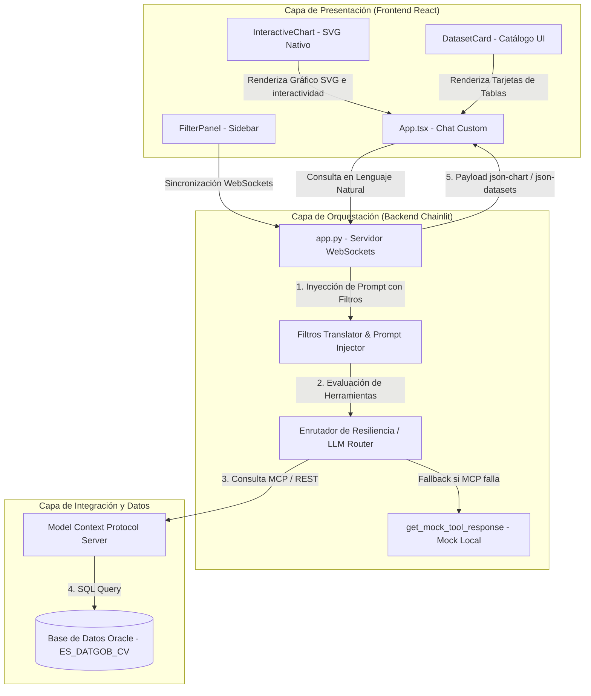

# Especificación de Arquitectura y Diseño: Prototipo OpenEnergy (AP0162)

## 1. Vista Arquitectónica Global
El sistema implementa una arquitectura desacoplada en capas cliente-servidor, que conecta un frontend web interactivo (React) con un backend de analítica e inteligencia artificial (Chainlit + LLM) a través de WebSockets en tiempo real, interactuando con un catálogo de datos gobernados a través de Model Context Protocol (MCP) y una base de datos Oracle institucional (resguardada con un mock local de resiliencia).

### 1.1. Diagrama de Flujo de Datos y Componentes


---

## 2. Descomposición de Software y Responsabilidades (SRP)

### 2.1. Capa de Presentación (Frontend)
*   **`App.tsx` (Controlador Principal):** Orquesta el estado de la aplicación, el historial de mensajes, la carga del sistema y las directivas de comunicación WebSockets con el backend de Chainlit.
*   **`FilterPanel.tsx` (Filtros Sidebar):** Provee controles interactivos para seleccionar la geografía y tecnologías energéticas, ejecutando la sincronización en caliente.
*   **`InteractiveChart.tsx` (Visualizador React):** Recibe el payload JSON estructurado y renderiza un gráfico vectorial SVG premium (barras, líneas, dispersión y pastel) con soporte de hovers dinámicos y descargas vectoriales independientes.
*   **`DatasetCard.tsx` (Tarjetas del Catálogo):** Renderiza visualmente metadatos de las tablas gobernadas, tales como el nombre físico, la descripción ejecutiva, el formato de archivo y la organización propietaria.

### 2.2. Capa de Orquestación y Resiliencia (Backend)
*   **`app.py` (Orquestador y WebSocket Server):** Administra el ciclo de vida del chat de Chainlit, los tokens de sesión dinámicos y la autenticación de analistas temporales únicos para evitar choque de sesiones.
*   **Mapeador y Prompt Injector:** Intercepta la sesión del usuario para inyectar reglas de traducción semántica rígidas (ej: mapear "Solar" a `TI_TIPO_CENTRAL = 'CENTRAL SOLAR'`) dentro del prompt del LLM.
*   **Enrutador de Resiliencia del LLM:** Implementa fallbacks y reintentos automáticos para enrutar las peticiones del usuario entre diferentes modelos de lenguaje (Gemini 3.5, 3.1) en caso de fallos de cuota o caídas de las APIs de IA.
*   **`get_mock_tool_response` (Mock de Datos Corporativos):** Módulo de resiliencia local que simula con precisión las tablas `CMO_TX_CENTRAL_GEN`, `VW_EESS_UBICACION_GEO` y `DEMANDA_DIARIA_ELEC` en caso de desconexión del servidor MCP, garantizando que el prototipo siga siendo 100% interactivo.

---

## 3. Matriz de Trazabilidad: Requisitos a Componentes

| Cód. Requisito | Descripción Breve | Componente Arquitectónico Responsable |
| :--- | :--- | :--- |
| **RF-01** | Consulta en Lenguaje Natural | `app.py` (LLM Orquestador) + MCP Server |
| **RF-02** | Consulta de Esquemas Gobernados | MCP Server (`query_data`) |
| **RF-03** | Sincronización de Filtros | `FilterPanel.tsx` (React) $\rightarrow$ `app.py` (Prompt Injector) |
| **RF-04** | Visualizaciones Interactivas | `InteractiveChart.tsx` + `App.tsx` (Parser Resiliente) |
| **RF-05** | Catálogo Dinámico en UI | `DatasetCard.tsx` + `App.tsx` (Parser Resiliente) |
| **RF-07** | Control Solo Lectura (DML/DDL) | Backend (`app.py`) + MCP Server (Oracle Privileges) |
| **RF-08** | Autologin e Identidad Temporal | `App.tsx` (Auto-Auth) $\rightarrow$ `app.py` (`password_auth_callback`) |
| **RF-09 (Futuro)** | Estandarización de Gráficas | `InteractiveChart.tsx` (Tokens CSS / Tailwind) |
| **RF-10 (Futuro)** | Modal de Ampliación | `InteractiveChart.tsx` (Modal de Ampliación Lightbox) |
| **RF-11 (Futuro)** | Descarga Multiformato y Excel | `InteractiveChart.tsx` (Exportadores a PNG/PDF/Excel) |
| **RF-12 (Futuro)** | Filtros Locales de Gráfico | `InteractiveChart.tsx` (Filtros en Caliente de Memoria) |
| **RNF-02** | Rendimiento Local del Mock | `app.py` (`get_mock_tool_response`) |
| **RNF-03** | Resiliencia ante Desconexión | `app.py` (`run_local_tool` try-catch fallback) |
| **RNF-06** | Control de Consumo (Rate Limit) | Backend (`app.py` / `is_rate_limited`) |

---

## 4. Registro de Decisiones de Arquitectura (ADR)

*   **ADR-01: Desacoplamiento Completo Frontend/Backend (Vite React + Chainlit API):**
    *   *Justificación:* Facilita que la interfaz de usuario se construya utilizando componentes visuales ricos e interactivos de React (impensables en el Markdown básico de Chainlit) y permite que toda la solución se migre fácilmente en el futuro hacia el portal unificado corporativo en **Angular 18+** utilizando los mismos payloads JSON y APIs de comunicación WebSockets.
*   **ADR-02: Mapeo de Filtros en Prompt del Sistema en lugar de Filtros SQL Duros en Código:**
    *   *Justificación:* Mantiene la flexibilidad de la consulta en lenguaje natural. En lugar de recortar la consulta SQL de forma rígida en Python, el LLM "entiende" los filtros del sidebar y los integra inteligentemente en sus llamadas al MCP (ej. aplicando `NO_DEPARTAMENTO: 'AREQUIPA'`), lo que permite responder preguntas cruzadas más complejas.
*   **ADR-03: Bloques JSON Estructurados en Flujo de Texto Markdown:**
    *   *Justificación:* El uso de delimitadores como ` ```json-chart ` y ` ```json-datasets ` inyectados de forma automatizada por el backend en el flujo de texto de Chainlit permite una transferencia de datos ligera y libre de problemas de serialización de sockets, permitiendo al frontend renderizar componentes ricos nativos de forma totalmente resiliente al formato.