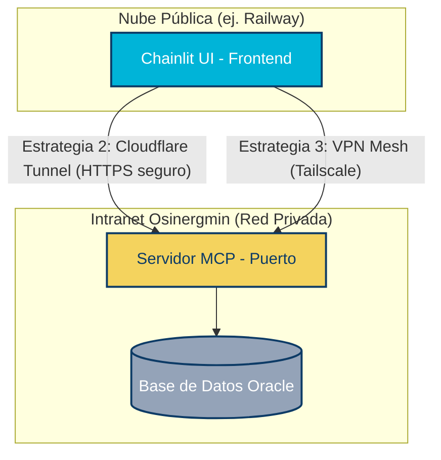

# 💼 Copiloto Ejecutivo de Inteligencia de Datos - Osinergmin

Este proyecto consiste en una interfaz inteligente basada en [Chainlit](https://docs.chainlit.io) que actúa como un copiloto ejecutivo para el descubrimiento, la consulta y el análisis visual de datos gobernados dentro de las áreas de **Osinergmin** (Electricidad, Gas Natural, Hidrocarburos, Tarifas, Demanda e Infraestructura).

La aplicación se comunica dinámicamente con un servidor **MCP (Model Context Protocol)** privado para traducir consultas analíticas en lenguaje natural en datos concretos, automatizar la generación de gráficos e inyectar contexto analítico adaptado a perfiles gerenciales.

---

## 🏛️ Arquitectura y Estrategias de Conexión

El ecosistema se divide en un frontend interactivo (**Chainlit UI**) y un backend de datos (**Servidor MCP**) que interactúa directamente con bases de datos internas (como Oracle). Dependiendo del entorno de despliegue, existen distintas alternativas para conectarlos:



### Opciones de Conexión y Despliegue:
*   **Despliegue 100% Interno (Intranet):** Hospedar tanto Chainlit como el Servidor MCP en la red local de Osinergmin. Los usuarios acceden compartiendo la IP privada (ej. `http://sdaadad6:8000`), abriendo previamente el puerto `8000` en el Firewall de Windows (Detalles en [indicaciones.md](file:///C:/Users/opaye/Proyectos/MCPdinamicoPrueba/indicaciones.md)).
*   **Cloudflare Tunnels (Recomendado para la Nube):** Usar `cloudflared` en el servidor interno para establecer una conexión HTTPS saliente segura hacia el exterior, permitiendo que el frontend de Chainlit desplegado en Railway consuma la API del MCP de forma directa (Detalles en [guia_cloudflare_tunnel.md](file:///C:/Users/opaye/Proyectos/MCPdinamicoPrueba/guias/guia_cloudflare_tunnel.md)).
*   **VPN Mesh con Tailscale:** Crear una red virtual cifrada privada entre el contenedor de Railway y la infraestructura corporativa de Osinergmin.
*   **Análisis detallado de ventajas/desventajas:** Disponible en [mcp_connection_strategy.md](filoPrueba/mcp_connection_strategy.md).

---

## 📈 Historial y Contraste del Desarrollo (Línea de Tiempo)

El diseño y optimización del agente se llevaron a cabo de forma incremental a través de los siguientes hitos técnicos:

| Fase | Documento de Registro | Foco del Cambio | Logros e Implementaciones |
| :--- | :--- | :--- | :--- |
| **Inicio** | *(Diagnóstico)* | Análisis de fallas de VS Code | Se detectó que el port-forwarding de GitHub (`devtunnels.ms`) fallaba debido a restricciones del proxy y de las cookies corporativas. |
| **Fase 2** | [paso2.md](fia/paso2.md) | Confianza de Red | Configuración del proxy en caliente. Se forzaron las variables `CHAINLIT_URL` y `CHAINLIT_AUTH_SECRET` en el script inicial de la aplicación para validar los JWT y cookies del navegador tras túneles. |
| **Fase 3** | [paso3.md](fa/paso3.md) | Limpieza y Localización | Eliminación del dashboard antiguo basado en Streamlit (`app.py` en la raíz) para centralizar todo el código en Chainlit. Creación de traducciones al español latinoamericano (`es-419.json`) y Markdown adaptados para evitar avisos técnicos. |
| **Fase 4** | [paso4.md](fia/paso4.md) | Enfoque de Negocio y Gráficos | Re-diseño profundo del `SYSTEM_PROMPT` para traducción semántica obligatoria y navegación progresiva. Implementación de **Inyección de Roles** de usuario. Adición de Matplotlib y flujo **HITL (Human-in-the-Loop)** para gráficos. |
| **Fase 5** | [paso5.md](a/paso5.md) | Resiliencia y Autonomía | Resolución de Rate Limits (error 429) ordenando la secuencia de modelos Gemini (Lite primero) y backoff. Inyección de reglas de autonomía absoluta (cero preguntas técnicas al usuario). Persistencia de conjuntos de datos entre turnos. |

---

## ✨ Características Destacadas

### 1. 💼 Inyección Dinámica de Contexto de Rol
El copiloto adapta automáticamente su tono, tecnicismo y alcance analítico en función del usuario autenticado en la sesión de Chainlit:
*   **Gerente Comercial:** Prioriza precios, tarifas reguladas, costos marginales y mercado de energía.
*   **Gerente de Operaciones:** Prioriza infraestructuras (centrales, subestaciones), capacidad física y almacenamiento de hidrocarburos.
*   **Administrador:** Habilita el uso directo de nombres de esquemas, tablas reales de bases de datos y detalles de ingeniería.

### 2. 📊 Visualización de Datos con Control HITL
El agente detecta peticiones de gráficos y analiza si el conjunto de datos activo en la sesión cuenta con campos temporales (eje X) y numéricos (eje Y) para dibujar gráficas de tendencia elegantes con Matplotlib.
*   **Human-in-the-Loop (HITL):** Antes de renderizar cualquier gráfico en pantalla, se le muestra al usuario una confirmación interactiva mediante botones de aprobación/cancelación.
*   **Persistencia:** La variable de sesión `last_tool_result` se mantiene disponible a lo largo de los turnos, permitiendo que una consulta analítica de datos previa sea graficada a posteriori mediante órdenes como *"grafica la tendencia"*.

### 3. 🛡️ Resiliencia y Enrutador Inteligente de LLMs
Para evitar fallas de servicio por saturación de cuotas (HTTP 429):
*   La aplicación desactiva los reintentos internos y realiza una rotación secuencial entre una lista ordenada de modelos (por ejemplo, `gemini-2.5-flash-lite` primero y `gemini-2.5-flash` como respaldo).
*   Se implementa un mecanismo de backoff exponencial adaptado de 4 segundos ante incidencias del proveedor.
*   Se silencia el ruido de librerías de red (`httpx` y `openai`) en consola.

### 4. 🧠 Descubrimiento Autónomo de Datos
El LLM tiene instrucciones estrictas para buscar la información por sí mismo. Ante una consulta gerencial, en lugar de preguntar qué columnas o tablas leer, ejecuta en segundo plano:
1.  `get_catalogo_datos` para localizar la tabla del negocio.
2.  `get_detalle_catalogo_datos` para examinar el diccionario de columnas (nombres y tipos).
3.  `query_data` para filtrar y consultar de forma exacta los registros.

### 5. ⏱️ Caché de Preguntas Frecuentes y Límite de Consumo
*   **Caché FAQ:** Almacena respuestas previas en memoria. Preguntas idénticas se responden al instante desde la caché, ahorrando coste y tiempo de procesamiento.
*   **Control de Consumo Justo:** Evita bucles infinitos o abusos limitando el uso a un máximo de 50 consultas cada 10 minutos por usuario.

---

## 🔑 Variables de Entorno (`.env`)

Crea un archivo `.env` en la raíz del proyecto para alojar la configuración de accesos. Ejemplo de claves configurables:

```ini
# Clave de API del modelo (Google AI Studio o OpenRouter)
GEMINI_API_KEY=tu_clave_api_aqui
# O bien: LLM_API_KEY=tu_token_de_openrouter

# Clave JWT de sesión para Chainlit (mínimo de 32 caracteres)
CHAINLIT_AUTH_SECRET=esta_es_una_clave_muy_segura_de_32_caracteres_minimo_123

# URL de exposición pública para el proxy / túnel de Chainlit
CHAINLIT_URL=

# Endpoint del Servidor MCP privado de Osinergmin
MCP_SERVER_URL=

# Modelos en orden de prioridad para balancear consumo y resiliencia
GEMINI_MODEL=gemini-3.5-flash, gemini-3.1-flash-lite,gemini-3-flash-preview, gemini-2.5-flash-lite, gemini-2.5-flash, 
```

---

## 🚀 Guía de Uso y Despliegue Rápido (Despliegue Local)

### Instalación:
1.  Asegúrate de contar con Python 3.10+ y levantar un entorno virtual:
    ```powershell
    python -m venv .venv
    .venv\Scripts\Activate.ps1
    ```
2.  Instala las dependencias congeladas del proyecto:
    ```powershell
    pip install -r requirements.txt
    ```

### Ejecución:
Levanta la aplicación indicando el host y puerto de escucha corporativo:
```powershell
chainlit run agente-mcp/app.py --host 0.0.0.0 --port 8000
```

### Credenciales de Demostración:
| Rol / Cargo | Usuario | Contraseña |
| :--- | :--- | :--- |
| **Administrador Técnico** | `admin` | `admin2026` |
| **Gerente Comercial** | `gerente_comercial` | `comercial2026` |
| **Gerente de Operaciones** | `gerente_operaciones` | `operaciones2026` |

---

## 📂 Estructura del Repositorio

A continuación se detalla la distribución de los componentes clave en el proyecto:

*   [agente-mcp/](f/agente-mcp): Directorio principal de la aplicación.
    *   [app.py](fil/agente-mcp/app.py): Código fuente que orquesta la lógica LLM, autenticación, resiliencia y Matplotlib.
    *   [chainlit_es-419.md](file:a/agente-mcp/chainlit_es-419.md): Pantalla de bienvenida en español.
    *   [log_uso.txt](fila/agente-mcp/log_uso.txt): Registro local de uso de tokens, usuarios y consultas realizadas.
    *   [requirements.txt](e-mcp/requirements.txt): Dependencias básicas de la aplicación modular.
*   [guias/](fimicoPrueba/guias): Tutoriales de infraestructura.
    *   [guia_cloudflare_tunnel.md](f/guias/guia_cloudflare_tunnel.md): Instrucciones para configurar e instalar `cloudflared` de forma persistente.
*   [indicaciones.md](f/indicaciones.md): Instrucciones rápidas para habilitar el Firewall de Windows y distribuir el enlace corporativo.
*   [mcp_connection_strategy.md](fmcp_connection_strategy.md): Estrategias híbridas de comunicación de red privado-público.
*   [requirements.txt](f): Conjunto completo de librerías congeladas del entorno.
*   `paso2.md`, `paso3.md`, `paso4.md`, `paso5.md`: Crónicas detalladas de la refactorización técnica llevada a cabo en cada fase del desarrollo.
