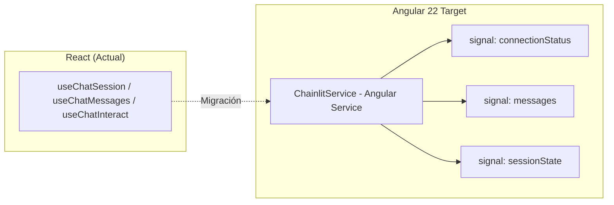

# Plan de Migración Tecnológica: De React a Angular (versiones 18 a 22)

Este documento detalla la investigación de las últimas versiones de **Angular (desde v18 hasta la v22 - Junio 2026)** y establece la estrategia y el plan de migración para el frontend del proyecto **OpenEnergy**, que actualmente está implementado en React 18 con Vite, Tailwind CSS y `@chainlit/react-client`.

---

## 1. Evolución de Angular (v18 a v22) y Elección de la Versión Target

Angular ha experimentado una revolución ("Renaissance") en los últimos dos años, transitando hacia una arquitectura más reactiva, ligera y orientada a **Signals** (sin zonas de cambio implícitas). Para nuestra migración corporativa, la versión objetivo recomendada es **Angular 22** (lanzada en junio de 2026), debido a la estabilidad de las APIs clave de reactividad.

### Tabla Comparativa de Hitos Recientes

| Versión | Lanzamiento | Características Clave y Mejoras |
| :--- | :--- | :--- |
| **Angular 18** | Mayo 2024 | • Flujo de control integrado nativo (`@if`, `@for`, `@defer` en plantillas).<br>• Soporte experimental para aplicaciones **Zoneless** (sin `zone.js`).<br>• Soporte estable para Material 3 e hidratación SSR mejorada. |
| **Angular 19** | Nov 2024 | • Componentes independientes (*standalone*) por defecto.<br>• `@linkedSignal` para actualizar señales basadas en otras.<br>• Previsualización de hidratación incremental basada en eventos en SSR. |
| **Angular 20** | Mayo 2025 | • Signals y `effect()` se declaran **estables**.<br>• Hidratación incremental madura y mejoras de rendimiento de carga crítica.<br>• Soporte nativo y optimizado para APIs del navegador modernas. |
| **Angular 21** | Nov 2025 | • **Zoneless** pasa a ser el modelo de detección de cambios recomendado por defecto.<br>• Soporte integrado y optimizado para **Vitest** en el build pipeline.<br>• Formularios basados en Signals (en fase experimental). |
| **Angular 22** | Junio 2026 | • **Signal Forms** declarados estables (formularios reactivos impulsados por Signals).<br>• APIs de recursos asíncronos estables (`resource`, `rxResource`, `httpResource`).<br>• Detección de cambios `OnPush` activa por defecto en nuevos componentes.<br>• **Angular Aria** estable para accesibilidad nativa y automatizada. |

### Beneficios del Modelo Target (Angular 22) para OpenEnergy
1. **Rendimiento Excepcional (Zoneless):** Al eliminar `zone.js`, la aplicación es significativamente más pequeña y rápida. La detección de cambios se realiza de forma puntual en las ramas de la UI donde las señales cambian.
2. **APIs Asíncronas nativas (`rxResource`):** Reemplazan la necesidad de usar librerías externas de fetching (como SWR) permitiendo cargar catálogos y datos directamente reactivos con el ciclo de vida del framework.
3. **Carga Diferida Inteligente (`@defer`):** Permite diferir la carga de componentes pesados (como los gráficos de Vega-Lite) hasta que entren en el viewport, mejorando drásticamente el tiempo de primera pintura (FCP).

---

## 2. Mapeo Arquitectónico: React $\rightarrow$ Angular 22

El proyecto actual consta de componentes interactivos de visualización que interactúan con un servidor de WebSockets administrado por el SDK de Chainlit.

### 2.1. Equivalencia de Componentes de Presentación

| Componente React Actual | Componente Angular 22 Standalone | Mecanismos de Plantilla y Reactividad |
| :--- | :--- | :--- |
| `App.tsx` | `AppComponent` | Gestión del layout principal, conexión al Socket e inyección de los componentes secundarios utilizando `@defer` para carga diferida. |
| `Sidebar.tsx` | `SidebarComponent` | Uso de señales (`input()`) para recibir `importedDatasets` e inputs de resultados, emitiendo eventos (`output()`) en la selección. |
| `FilterPanel.tsx` | `FilterPanelComponent` | Formularios interactivos sincronizados con señales (`model()`) bidireccionales y Signal Forms para el control fino. |
| `DatasetCard.tsx` | `DatasetCardComponent` | Renderización de metadatos de las tablas. Componente *pure* (OnPush). |
| `VegaLiteChart.tsx` | `VegaLiteChartComponent` | Carga diferida con `@defer (on viewport)`. Renderiza el canvas SVG dinámico invocando `vega-embed` al cambiar la señal de datos. |
| `OsamRenderer.tsx` | `OsamRendererComponent` | Procesador principal de bloques Markdown y JSON personalizados (`json-chart`, `json-datasets`). |
| `OsamTable.tsx` | `OsamTableComponent` | Renderizador de tablas utilizando la directiva nativa `@for` y señales ordenables. |

### 2.2. Manejo de Estado y Conectividad (Chainlit)

Dado que **no existe una librería oficial de Chainlit para Angular**, la migración requiere implementar un servicio centralizado (`ChainlitService`) utilizando `socket.io-client`. Este servicio emulará el comportamiento de los React hooks de `@chainlit/react-client`:



---

## 3. Estructura de Directorios Propuesta en Angular 22

El código se organizará bajo la arquitectura recomendada por Angular, enfocada en módulos funcionales y componentes independientes (*standalone*):

```text
src/
├── app/
│   ├── app.config.ts          # Configuración global (providers, hydration, zoneless)
│   ├── app.component.ts       # Layout y controlador raíz
│   ├── app.component.css      # Estilos globales del layout
│   │
│   ├── api/                   # Servicios e integraciones externas
│   │   └── chainlit.service.ts # Cliente custom WebSocket/HTTP para Chainlit
│   │
│   ├── domain/                # Modelos, interfaces y tipos de datos
│   │   ├── dataset.model.ts   # Equivalente a IDataset
│   │   └── chat.model.ts      # Equivalente a IFilterState, IResultItem
│   │
│   └── ui/                    # Componentes visuales organizados por responsabilidad
│       ├── sidebar/           # SidebarComponent
│       ├── filter-panel/      # FilterPanelComponent
│       ├── dataset-card/      # DatasetCardComponent
│       ├── vega-chart/        # VegaLiteChartComponent
│       ├── osam-table/        # OsamTableComponent
│       └── osam-renderer/     # OsamRendererComponent (Markdown Parser)
│
├── assets/                    # Imágenes, iconos estáticos y estilos base
├── index.html
├── main.ts                    # Bootstrap de la aplicación en modo Zoneless
└── styles.css                 # Importación de Tailwind CSS v4.0
```

---

## 4. Diseño del Servicio Core: `ChainlitService`

A continuación se presenta el diseño del servicio TypeScript que reemplazará a `@chainlit/react-client`. Este servicio gestionará la sesión por WebSockets, exponiendo el estado como **Signals** nativas de Angular para asegurar la reactividad óptima.

```typescript
import { Injectable, signal, computed, effect } from '@angular/core';
import { io, Socket } from 'socket.io-client';
import { IDataset, IFilterState, IResultItem } from '../domain/chat.model';

@Injectable({
  providedIn: 'root'
})
export class ChainlitService {
  // Configuración del servidor dinámica
  private isDev = window.location.port === "4200"; // Puerto por defecto de Angular dev
  private serverUrl = this.isDev
    ? `${window.location.protocol}//${window.location.hostname}:8000`
    : window.location.origin;

  private socket: Socket | null = null;

  // Estados expuestos como Signals reactivas
  readonly connected = signal<boolean>(false);
  readonly messages = signal<any[]>([]);
  readonly importedDatasets = signal<IDataset[]>([]);
  readonly results = signal<IResultItem[]>([]);
  readonly session = signal<any>(null);

  // Computed signals derivadas para optimización
  readonly flatMessages = computed(() => this.flatten(this.messages()));

  constructor() {
    // Escucha cambios de estado o depuración si es necesario
    effect(() => {
      console.log(`Conexión Chainlit: ${this.connected() ? 'Establecida' : 'Desconectada'}`);
    });
  }

  /**
   * Inicializa la sesión WebSocket contra el backend de Chainlit
   */
  connect(accessToken?: string) {
    if (this.socket) return;

    this.socket = io(this.serverUrl, {
      path: '/ws/socket.io',
      transports: ['websocket'],
      auth: { token: accessToken || '' }
    });

    this.socket.on('connect', () => {
      this.connected.set(true);
      // Emitimos el inicio del chat según protocolo Chainlit
      this.socket?.emit('connection', { clientType: 'webapp' });
    });

    this.socket.on('disconnect', () => {
      this.connected.set(false);
    });

    // Escucha de mensajes entrantes
    this.socket.on('new_message', (message: any) => {
      this.messages.update(prev => [...prev, message]);
      this.parseMessageContent(message);
    });

    // Escucha de tokens (Streaming)
    this.socket.on('stream_token', (data: { id: string, token: string }) => {
      this.messages.update(prev => this.updateStreamedToken(prev, data.id, data.token));
    });
  }

  /**
   * Envía un mensaje en lenguaje natural al backend
   */
  sendMessage(text: string, filters: IFilterState) {
    if (!this.socket) return;

    const payload = {
      id: crypto.randomUUID(),
      content: text,
      metadata: { filters },
      createdAt: new Date().toISOString()
    };

    this.messages.update(prev => [...prev, { ...payload, type: 'user_message' }]);
    this.socket.emit('ui_message', payload);
  }

  /**
   * Ejecuta una acción (ej: importar dataset de las tarjetas de catálogo)
   */
  callAction(actionName: string, payload: any) {
    this.socket?.emit('action_click', { name: actionName, payload });
  }

  /**
   * Parsea bloques markdown de respuesta para catalogar imágenes, tablas y charts
   */
  private parseMessageContent(message: any) {
    if (message.type === 'assistant_message' && message.content) {
      // Detección de bloques ```json-chart
      if (message.content.includes('```json-chart')) {
        // Lógica de parsing para popular la señal 'results'
      }
      // Detección de bloques ```json-datasets
      if (message.content.includes('```json-datasets')) {
        // Lógica de parsing para popular la señal 'importedDatasets'
      }
    }
  }

  private updateStreamedToken(messages: any[], messageId: string, token: string): any[] {
    // Retorna una nueva lista actualizando el mensaje que tiene el streaming de tokens
    return messages.map(msg => {
      if (msg.id === messageId) {
        return { ...msg, content: (msg.content || '') + token };
      }
      if (msg.steps) {
        return { ...msg, steps: this.updateStreamedToken(msg.steps, messageId, token) };
      }
      return msg;
    });
  }

  private flatten(items: any[]): any[] {
    let flat: any[] = [];
    items.forEach(item => {
      if (item.type === 'user_message' || item.type === 'assistant_message') {
        flat.push(item);
      }
      if (item.steps && item.steps.length > 0) {
        flat = flat.concat(this.flatten(item.steps));
      }
    });
    return flat;
  }
}
```

---

## 5. Plan de Ejecución de la Migración en 5 Fases

La migración se estructurará de manera incremental para asegurar que no haya regresiones visuales o de comunicación con el backend Chainlit existente.

### Fase 1: Inicialización del Entorno (Angular 22)
*   **Acción:** Crear la aplicación utilizando Angular CLI (versión v22) con el flag zoneless activo por defecto.
    ```bash
    npx -y @angular/cli@latest new openenergy-frontend --style css --ssr false --routing false
    ```
*   **Configuración de Detección de Cambios Zoneless:**
    En `src/app/app.config.ts`, proveer la detección de cambios sin Zone.js:
    ```typescript
    import { ApplicationConfig, provideExperimentalZonelessChangeDetection } from '@angular/core';

    export const appConfig: ApplicationConfig = {
      providers: [
        provideExperimentalZonelessChangeDetection()
      ]
    };
    ```
*   **Integración de Tailwind CSS v4:** Instalar Tailwind CSS y configurar el plugin Vite en `angular.json` o en el bundler interno para coincidir con la estilización basada en clases utilitarias actual.

### Fase 2: Servicios Core y Tipado de Datos
*   **Acción:** Crear los modelos en la carpeta `domain` e implementar el servicio `ChainlitService` detallado en la Sección 4.
*   **Objetivo:** Probar la conexión WebSocket de forma aislada. Registrar en consola los mensajes que llegan del backend al realizar interacciones básicas.

### Fase 3: Migración de Componentes Hoja (Pure & Presentation Components)
*   **Acción:** Traducir los componentes que no manejan estado de conexión.
    1.  `DatasetCardComponent`: Mapear props React a `input<IDataset>()` de Angular.
    2.  `FilterPanelComponent`: Mapear el estado a `model<IFilterState>()` (señales bidireccionales).
    3.  `SidebarComponent`: Implementar la lista dinámica utilizando la directiva `@for` sobre la señal de resultados.
    4.  `VegaLiteChartComponent`: Cargar la librería `vega-embed` dinámicamente en el ciclo `ngOnInit` o usando la API `effect()` para volver a renderizar el canvas cuando cambien los datos de entrada.

### Fase 4: Orquestación Visual (OsamRenderer & Main Layout)
*   **Acción:** Implementar `OsamRendererComponent` que analiza el markdown.
*   **Optimización Clave (`@defer`):**
    En la plantilla de `AppComponent`, estructurar el renderizado dinámico de los resultados del chat utilizando bloques `@defer` para evitar el bloqueo del hilo principal con gráficos pesados:
    ```html
    @for (item of chainlit.results(); track item.id) {
      @defer (on viewport) {
        @if (item.type === 'chart') {
          <app-vega-chart [data]="item.data"></app-vega-chart>
        } @else {
          <app-osam-table [data]="item.data"></app-osam-table>
        }
      } @placeholder {
        <div class="p-6 bg-slate-50 rounded-2xl animate-pulse text-xs text-slate-400">
          Cargando visualización interactiva...
        </div>
      }
    }
    ```

### Fase 5: Pruebas de Estrés y Ajuste Fino
*   **Acción:** Validar la resiliencia de la conexión de sockets en escenarios de microcortes de red.
*   **Pruebas:** Asegurar que el parser de markdown en Angular reconstruya de forma idéntica los bloques JSON inyectados en el flujo de texto en tiempo real.
*   **Despliegue:** Construir el bundle de producción (`ng build`) y verificar la reducción del peso de los archivos JS gracias al modo Zoneless y al empaquetamiento optimizado de Angular 22.

---

## 6. Gestión de Riesgos y Mitigación

1. **Riesgo: Falta del cliente oficial de Chainlit para Angular**
   * *Mitigación:* Se ha provisto un diseño completo de socket events (`new_message`, `stream_token`, `ui_message`, `action_click`) en el servicio core. Este diseño emula la especificación interna del protocolo Socket.IO de Chainlit.
2. **Riesgo: Pérdida de rendimiento en gráficos de Vega-Lite**
   * *Mitigación:* El uso de la directiva `@defer (on viewport)` en Angular 22 asegura que la librería Vega y sus dependencias solo se instancien cuando el gráfico es visible para el analista, reduciendo el consumo de memoria del navegador.
3. **Riesgo: Estilización rota con Tailwind v4**
   * *Mitigación:* Angular 22 se integra nativamente con PostCSS y los builders modernos basados en Vite/Esbuild. Al copiar las clases de utilidad de React directamente a las plantillas HTML de Angular, el diseño corporativo se preservará en un 100% gracias a que ambos usan la misma biblioteca CSS utilitaria.
