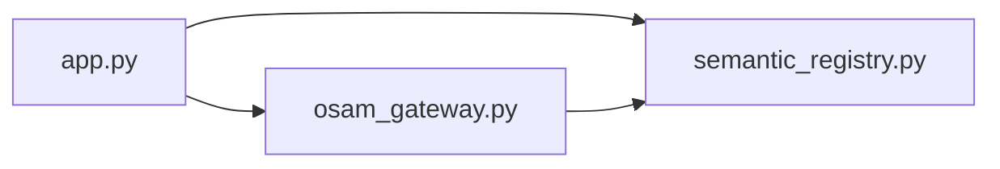
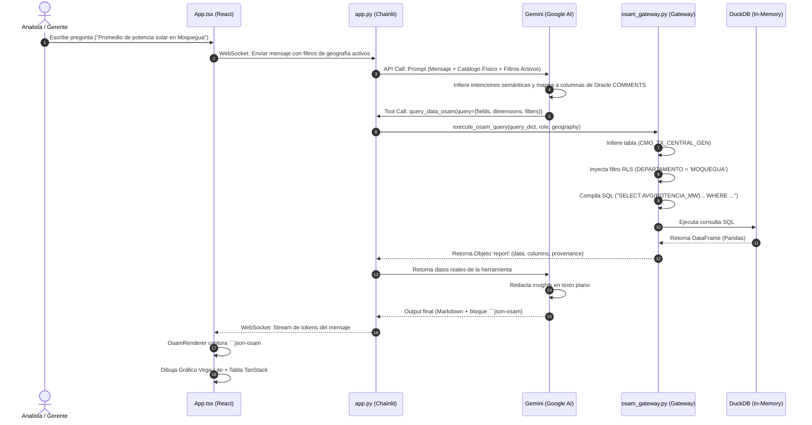
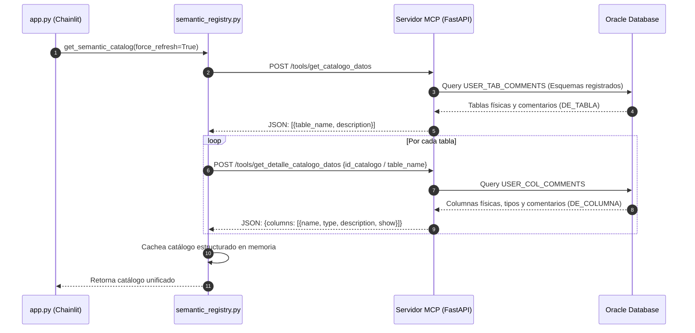
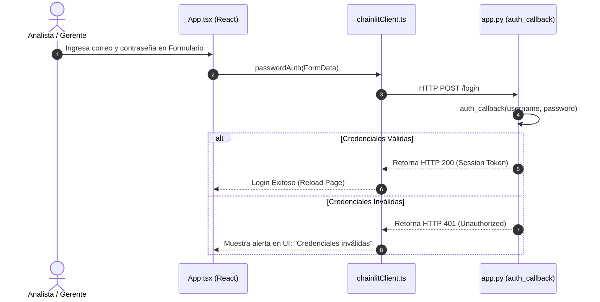

# Cartografía Arquitectónica Viva: OpenEnergy / OSAM v2

Este documento constituye la cartografía arquitectónica viva y el mapa maestro de referencia técnica de **OpenEnergy (Año 1)**. Ha sido generado mediante un análisis estático completo del código fuente del repositorio y detalla las dependencias físicas, los contratos estructurados de datos, el linaje, la deuda técnica y el roadmap evolutivo.

---

## 1. Mapa Físico del Código Fuente

El repositorio está estructurado en capas desacopladas que separan la interfaz de usuario, la orquestación conversacional, el motor de compilación lógica y las utilidades de prueba:

### Estructura de Carpetas del Proyecto
```
MCPdinamicoPrueba/
│
├── agente-mcp/                     # Capa de Backend y Orquestación
│   ├── app.py                      # Servidor Chainlit principal, auth y LLM Router
│   ├── osam_gateway.py             # Compilador SQL, motor analítico local y RLS
│   ├── semantic_registry.py        # Cliente HTTP del catálogo en caliente del MCP
│   └── semantic_catalog.json       # Caché persistente de respaldo del catálogo físico
│
├── frontend/                       # Capa de Presentación (React Single Page App)
│   ├── src/
│   │   ├── api/
│   │   │   └── chainlitClient.ts   # Cliente API REST y WebSocket de Chainlit
│   │   ├── domain/
│   │   │   └── types/
│   │   │       └── chat.ts         # Contratos de tipos de filtros y estados TS
│   │   ├── ui/
│   │   │   ├── App.tsx             # Layout principal del Chat e interactividad
│   │   │   └── components/
│   │   │       ├── Sidebar.tsx     # Barra de navegación e índice de datasets
│   │   │       ├── FilterPanel.tsx # Panel de control de RLS y filtros geográficos
│   │   │       ├── DatasetCard.tsx # Tarjetas de descubrimiento del catálogo
│   │   │       ├── OsamRenderer.tsx# Orquestador del metamodelo json-osam
│   │   │       ├── VegaLiteChart.tsx# Adaptador declarativo de gráficos Vega-Lite
│   │   │       └── OsamTable.tsx   # Tabla interactiva (TanStack Table)
│   │   └── index.css               # Estilos globales y tokens del tema corporativo
│   └── package.json
│
├── tests/                          # Capa de Validación y Testing
│   ├── run_benchmark_eval.py       # Suite del Benchmark de precisión (50 casos)
│   └── test_osam_gateway.py        # Unit tests para el OSAM Gateway analítico
│
└── scratch/                        # Scripts diagnósticos e instrumentos auxiliares
    ├── verificar_mcp.py            # Validador de conexión al servidor MCP real
    └── test_gemini_thought.py      # Test experimental del flujo del LLM
```

### Componentes Críticos
1.  **`osam_gateway.py` (Crítico - Backend):** Responsable de recibir la intención lógica (`fields`, `dimensions`, `filters`) de la IA, verificar la existencia física de las columnas en el catálogo de base de datos para prevenir inyecciones de código, inyectar el filtro regional RLS determinista y compilar el SQL plano ejecutado en DuckDB.
2.  **`semantic_registry.py` (Alto - Backend):** Responsable de comunicarse vía API REST con el MCP para traerse la metadata de Oracle (`NO_TABLA`, `NO_COLUMNA`, `DE_COLUMNA`) en caliente, normalizarla y cachearla para evitar saturación de red.
3.  **`OsamRenderer.tsx` (Crítico - Frontend):** Orquestador de renderizado en cliente React. Parsea bloques Markdown `json-osam` inyectados en el stream del chat y distribuye los datos a la tabla TanStack y al gráfico Vega-Lite, mostrando de manera transparente el linaje de procedencia RLS.
4.  **`VegaLiteChart.tsx` (Alto - Frontend):** Adaptador que recibe la especificación abstracta de presentación (ejes, series, tipo de gráfico) y la compila en una especificación declarativa JSON de Vega-Lite, renderizándola interactivamente en el DOM.

### Archivos Huérfanos y Documentos Históricos
*   **`prueba.py` (Raíz):** Script de depuración en desuso.
*   **`paso2.md`, `paso3.md`, `paso4.md`, `paso5.md`:** Archivos markdown descriptivos de sprints de diseño anteriores, obsoletos respecto al runtime analítico actual.
*   **`flashcards-conexion.md`, `flashcards-llm.md`:** Resúmenes teóricos explicativos fuera de la compilación de producción.

---

## 2. Grafo de Dependencias (Dependency Graph)

### Relaciones de Importación
*   **Backend Imports:**
    *   `app.py` ➔ importa `execute_osam_query` de `osam_gateway`
    *   `app.py` ➔ importa `get_semantic_catalog` de `semantic_registry`
    *   `osam_gateway.py` ➔ importa `get_semantic_catalog` de `semantic_registry`
    *   `semantic_registry.py` ➔ independiente de lógica interna (solo depende de `requests` y variables de entorno).



*   **Frontend Imports:**
    *   `main.tsx` ➔ importa `App` de `./ui/App`
    *   `App.tsx` ➔ importa `Sidebar`, `FilterPanel`, `DatasetCard`, `OsamRenderer`
    *   `OsamRenderer.tsx` ➔ importa `VegaLiteChart`, `OsamTable`
    *   `VegaLiteChart.tsx` ➔ importa `vega-embed`
    *   `OsamTable.tsx` ➔ importa `@tanstack/react-table`

### Acoplamientos Peligrosos y Dependencias Circulares
*   **Dependencias Circulares:** Ninguna detectada. El flujo de backend es estrictamente descendente: `app.py` ➔ `osam_gateway` ➔ `semantic_registry`.
*   **Módulos Altamente Acoplados:** `osam_gateway.py` y `app.py` están fuertemente acoplados a la estructura del catálogo en caliente provista por `semantic_registry.py`. Cualquier cambio de nombres de columnas en la salida de `get_semantic_catalog` impacta directamente la inferencia de tablas y la validación física en el Gateway.

---

## 3. Diagramas de Secuencia (Sequence Diagrams)

### A. Flujo de Consulta Analítica (OSAM v2)


### B. Flujo de Carga de Catálogo desde el MCP


### C. Flujo de Autenticación


---

## 4. Linaje de Datos (Data Lineage)

Este mapa detalla las transformaciones del dato y de su metadato a lo largo de las capas del sistema, desde la base de datos hasta la pantalla del usuario:

```
[Oracle Database]
   │  - Datos crudos almacenados físicamente.
   │  - Comentarios del diccionario (COMMENT ON TABLE / COLUMN).
   ▼
[MCP Server]
   │  - Convierte el diccionario de Oracle en esquemas JSON unificados.
   │  - Mantiene nombres en mayúsculas (NO_TABLA, NO_COLUMNA).
   ▼
[Semantic Registry]
   │  - Filtra columnas marcadas como no visibles (show/BO_MOSTRAR).
   │  - Mapea tipos físicos a tipos lógicos primitivos (VARCHAR2 -> nominal, NUMBER -> quantitative).
   ▼
[LLM (Gemini)]
   │  - Traduce lenguaje natural a consulta abstracta OSAM.
   │  - Resuelve sinónimos mapeando texto a columnas mediante lectura de descripciones.
   ▼
[OSAM Gateway]
   │  - Infiere tabla física destino en base a la intersección de columnas solicitadas.
   │  - Inyecta Row-Level Security (RLS) basado en la sesión del usuario.
   │  - Compila a sentencia SQL ANSI nativa ejecutada en DuckDB.
   ▼
[JSON-OSAM Payload]
   │  - Estructura los datos crudos resultantes junto con la metadata visual (presentation)
   │    y el linaje (provenance con hash SHA256 de consulta y filtros aplicados).
   ▼
[Frontend Renderers]
   │  - TanStack Table: Aplica formato visual a números cuantitativos (2 decimales).
   │  - Vega-Lite: Mapea columnas físicas a ejes cartesianos (X, Y) y leyendas de color.
```

---

## 5. Mapa del MCP (Model Context Protocol)

El Servidor MCP es la única compuerta de acceso al catálogo físico de Oracle. Su inventario de herramientas es el siguiente:

### 1. `get_catalogo_datos`
*   **Entrada:** Ninguna (`{}`)
*   **Salida:** Array de objetos representando las tablas registradas en el catálogo de datos gobernados de Osinergmin.
    ```json
    [
      {
        "table_name": "CMO_TX_CENTRAL_GEN",
        "description": "Centrales de generación eléctrica registradas en el sistema SEIN"
      }
    ]
    ```
*   **Consumidor Principal:** `semantic_registry.py` (durante la inicialización).

### 2. `get_detalle_catalogo_datos`
*   **Entrada:** `{ "id_catalogo": integer }` (o `{ "table_name": string }` como fallback legado).
*   **Salida:** Estructura de columnas de la tabla con tipos físicos y comentarios nativos obtenidos desde `USER_COL_COMMENTS`.
    ```json
    {
      "table_name": "CMO_TX_CENTRAL_GEN",
      "columns": [
        {
          "name": "POTENCIA_MW",
          "type": "NUMBER",
          "description": "Capacidad o potencia nominal instalada de la central en Megavatios",
          "show": true
        }
      ]
    }
    ```
*   **Consumidor Principal:** `semantic_registry.py` (ejecutado iterativamente por cada tabla).

---

## 6. Inventario de Decisiones de Arquitectura (ADR Inventory)

### ADR-01: COMMENTS de Oracle como Fuente de Verdad Semántica (Existente)
*   **Decisión:** Utilizar los comentarios nativos de base de datos (`USER_TAB_COMMENTS`, `USER_COL_COMMENTS`) en Oracle para alimentar el contexto semántico de la IA.
*   **Alternativas Descartadas:** Glosarios semánticos locales en JSON estáticos (descartados por riesgo crítico de desincronización con el catálogo real).
*   **Razones:** Garantiza que el gobierno de datos se mantenga centralizado en el motor Oracle corporativo.

### ADR-02: Prohibición de uniones dinámicas (JOINS) en la IA (Existente)
*   **Decisión:** Toda consulta que involucre relacionar múltiples tablas físicas debe resolverse mediante **Vistas Consolidadas** en base de datos.
*   **Alternativas Descartadas:** Permitir al LLM deducir las relaciones y escribir sentencias `JOIN` complejas en caliente (descartado por riesgo de Fan-Out y alucinación).
*   **Razones:** Mantiene las consultas deterministas y protege el rendimiento.

### ADR-03: Motor Gráfico Declarativo Vega-Lite (Existente)
*   **Decisión:** Unificar la renderización visual en el cliente React utilizando Vega-Lite (`vega-embed`).
*   **Alternativas Descartadas:** Motores SVG personalizados y layouts estáticos custom en frontend.
*   **Razones:** Flexibilidad para dibujar líneas, barras, pastel y dispersión mediante un único contrato declarativo abstracto.

### ADR-04: Motor Analítico local con DuckDB (Implícito en Código)
*   **Decisión:** El backend utiliza DuckDB en memoria para instanciar réplicas locales de datos y procesar agregaciones.
*   **Razones:** Evita sobrecargar Oracle transaccional con consultas analíticas recurrentes y permite ejecutar agregaciones rápidas sobre dataframes de forma aislada.

### ADR-05: Aplanamiento de Historial del Turno de Chat (Implícito en Código)
*   **Decisión:** En `app.py`, la función `stream_llm_response` limpia las llamadas a herramientas y payloads JSON de turnos pasados antes de llamar a Gemini.
*   **Razones:** Optimiza drásticamente el tamaño del contexto de tokens de Gemini y previene errores `400 Invalid Argument` de llamadas a herramientas repetitivas.

---

## 7. Registro de Deuda Técnica y Riesgos

1.  **Riesgo de Rendimiento en Carga Inicial (Cuello de Botella):** Al iniciar la sesión, `semantic_registry.py` realiza consultas HTTP secuenciales al MCP para cada tabla (`get_detalle_catalogo_datos`). Si el catálogo crece a más de 150 tablas, el tiempo de inicialización del chat se elevará a más de 10-15 segundos.
    *   *Deuda Aceptada:* Se requiere paralelizar las llamadas a metadatos de columnas en backend utilizando `asyncio.gather` en futuros sprints.
2.  **Mapeo Rígido de Fechas (Suposición Oculta):** El compilador y renderizador asumen que la columna temporal se llama `FECHA` o contiene "FECHA" en su nombre físico. Si negocio nombra una columna de fechas como `FE_REGISTRO` o `PERIODO_DIA`, el frontend la tratará como nominal, rompiendo los gráficos de tendencia temporal.
    *   *Deuda Aceptada:* Falta un mapeo estricto del tipo `DATE` desde Oracle en el Gateway para inyectar explícitamente `"type": "temporal"`.
3.  **Seguridad RLS basada en string (Acoplamiento Geográfico):** El RLS en `osam_gateway.py` busca textualmente si la columna se llama `DEPARTAMENTO` para aplicar el filtro regional. Si una tabla tiene datos regionales pero la columna se llama `ID_REGION` o `UBICACION`, el RLS no se aplicará, provocando una fuga potencial de datos de otras regiones.
    *   *Deuda Aceptada:* Se asume la homogenización estricta de la columna `DEPARTAMENTO` en todas las vistas de negocio en base de datos.

---

## 8. Evolution Roadmap (Evolución de Gobernanza)

```
AÑO 1: MVP Catálogo Físico (Mantener)
   ├─ Conservar el enfoque de COMMENTS nativos de Oracle como única fuente.
   ├─ Prohibir Joins analíticos libres del LLM en caliente.
   └─ RLS estricto por coincidencia de columna "DEPARTAMENTO".

AÑO 2: Gobernanza Vectorial y Paralelismo (Migrar)
   ├─ Reemplazar consultas secuenciales de metadatos con llamadas asíncronas en paralelo.
   ├─ Embeddings locales de los COMMENTS para soportar búsquedas de tablas por similitud semántica.
   └─ Mapeador dinámico de tipos de fecha basado en tipos de datos de Oracle (DATE, TIMESTAMP).

AÑO 3: Capa Semántica Gobernada (Futuro)
   ├─ Tabla física en Oracle para KPIs regulados y fórmulas matemáticas pre-registradas.
   └─ Integración de Catálogo federado multi-esquema.
```

> [!IMPORTANT]
> **Regla de Gobernanza Año 1:**
> Queda terminantemente prohibido almacenar sinónimos, metadatos o esquemas semánticos en archivos locales JSON o variables del bot. Si una columna analítica no es entendida por la IA, la única acción válida es **actualizar el comentario de la columna (`COMMENT ON COLUMN`) en el diccionario de Oracle**.

---

## 9. Matriz de Impacto de Cambios (Change Impact Matrix)

Esta sección define el impacto técnico de modificar cualquier componente crítico, endpoint de catálogo, esquema o contrato de la plataforma, distinguiendo entre dependencias directas en código y comportamientos inferidos en tiempo de ejecución:

| Elemento Crítico / Módulo / Contrato | Dependencias Observadas (Estáticas) | Dependencias Inferidas (Comportamiento/Runtime) | Pruebas de Regresión Requeridas | Nivel de Riesgo |
| :--- | :--- | :--- | :--- | :---: |
| **Endpoint MCP `get_catalogo_datos`** | - `semantic_registry.py` (Línea 30: POST call) | - `app.py` (Inicialización en `start()` para caché de sesión)<br>- LLM (Descubrimiento y sugerencias de datasets en el chat). | - `scratch/verificar_mcp.py`<br>- Ejecución inicial de app Chainlit (verificar catálogo en consola). | **ALTO** |
| **Endpoint MCP `get_detalle_catalogo_datos`** | - `semantic_registry.py` (Línea 54: POST call) | - `osam_gateway.py` (Validación física de columnas en caliente)<br>- LLM (Asociación de variables en base a descripciones). | - `tests/test_osam_gateway.py`<br>- Suite del benchmark analítico. | **CRÍTICO** |
| **Módulo `semantic_registry.py`** | - `app.py` (Líneas 29, 1071)<br>- `osam_gateway.py` (Línea 6) | - LLM (Su salida serializada alimenta el Prompt de Sistema). | - `scratch/verificar_mcp.py`<br>- Unit tests de orquestación en caliente. | **CRÍTICO** |
| **Módulo `osam_gateway.py`** | - `app.py` (Línea 28, 1357) | - DuckDB (Inyección local de RLS geográfico por departamento). | - `tests/test_osam_gateway.py` (Unit tests de compilación SQL y RLS). | **CRÍTICO** |
| **Contrato Semántico `json-osam`** | - `App.tsx` (Línea 546: regex check para renderizado)<br>- `OsamRenderer.tsx` (Línea 47: Payload prop typing) | - LLM (Gemini debe emitir el bloque Markdown con formato exacto al final). | - Prueba manual de chat: Enviar consulta y verificar renderizado de tabla y gráfico en UI. | **ALTO** |
| **Esquema de Entrada `query_data_osam`** | - `app.py` (Líneas 989-1048: Tool JSON Schema) | - `osam_gateway.py` (Argumentos del método `execute_osam_query`). | - Suite del benchmark (`tests/run_benchmark_eval.py`). | **ALTO** |
| **Componente React `OsamRenderer.tsx`** | - `App.tsx` (Línea 551: renderizado en chat) | - `VegaLiteChart.tsx` (Props de gráfico)<br>- `OsamTable.tsx` (Props de tabla TanStack). | - `npm run build` (Compilación de React)<br>- Verificación visual de linaje y exportación CSV. | **ALTO** |
| **Componente React `VegaLiteChart.tsx`** | - `OsamRenderer.tsx` (Línea 86: renderizado) | - Librería externa `vega-embed` y compatibilidad DOM. | - Comprobación visual de interactividad y zoom en gráficos. | **MEDIO** |

---

## 10. Bitácora de Decisiones (Decision Log)

Esta bitácora registra las decisiones clave tomadas a nivel arquitectónico y de código, detallando sus justificaciones y el impacto directo en la deuda técnica:

### 2026-06-05
*   **Decisión:** Unificar visualizaciones uniendo TanStack Table y Vega-Lite, eliminando motores custom SVG.
*   **Razón:** Reducir la sobreingeniería en el cliente React y asegurar un contrato declarativo abstracto simple para que la IA dibuje gráficos.
*   **Impacto:** Decomiso físico de `InteractiveChart.tsx` y la carpeta `charts/`, reduciendo el peso del bundle del frontend.
*   **Reevaluar:** N/A.

### 2026-06-05
*   **Decisión:** Eliminar el cascade multi-modelo en el Router del backend ([app.py](file:///C:/Users/opaye/Proyectos/MCPdinamicoPrueba/agente-mcp/app.py)).
*   **Razón:** El cascade saturaba las cuotas y rate limits HTTP 429 al ciclar por modelos no disponibles.
*   **Impacto:** Se fijó un único modelo oficial (`gemini-2.5-flash` o el configurado corporativamente) con reintentos exponenciales limpios.
*   **Reevaluar:** Si la tasa de fallos de la API del proveedor de LLM supera el 5% mensual.

### 2026-06-08
*   **Decisión:** No adoptar el patrón *MCP Toolbox* granular y mantener la carga del catálogo consolidada en el arranque.
*   **Razón:** El catálogo analítico actual es pequeño (<150 tablas), por lo que una carga consolidada reduce la complejidad de la conversación del LLM.
*   **Impacto:** Menor latencia conversacional por turno (evita cascadas de sub-llamadas MCP).
*   **Reevaluar:** Cuando el catálogo de base de datos de Osinergmin supere las 150 tablas físicas.

### 2026-06-08
*   **Decisión:** Prohibir terminantemente que el LLM genere uniones analíticas dinámicas (`JOIN`) de tablas en caliente.
*   **Razón:** Riesgo crítico de "Fan-Out", cruces cartesianos incorrectos y alucinación de claves lógicas en producción.
*   **Alternativa:** Toda relación o cruce analítico de múltiples tablas debe ser pre-construido por Ingeniería de Datos en Oracle como una **Vista Consolidada**.
*   **Impacto:** Asegura consistencia de negocio al 100%.

### 2026-06-08
*   **Decisión:** Envolver la precarga de herramientas del servidor MCP en un bloque try-except en `app.py`.
*   **Razón:** Prevenir fallos catastróficos y detenciones durante el arranque de Chainlit (`on_chat_start`) cuando el servidor MCP remoto de Osinergmin esté offline.
*   **Impacto:** El sistema inicia correctamente y degrada de forma segura a herramientas analíticas locales (`crear_grafico` y `query_data_osam`), utilizando el caché local `semantic_catalog.json` para mantener la inteligencia semántica operativa.

---

## 11. Glosario de Términos (Glossary)

*   **MCP (Model Context Protocol):** Protocolo de comunicación abierta que expone herramientas de base de datos directamente al LLM. Actúa como el puente seguro entre el modelo y los metadatos físicos de Oracle.
*   **OSAM v2:** Metamodelo lógico de consulta analítica. Es la estructura JSON abstracta (`fields`, `dimensions`, `filters`) generada por el LLM para representar una intención de consulta de datos gobernada.
*   **json-osam:** El bloque Markdown estructurado conteniendo el reporte analítico (`report`) y las interpretaciones ejecutivas (`analysis`) que el LLM escribe al final de su mensaje en texto libre para que el frontend lo renderice.
*   **semantic_registry (semantic_registry.py):** Módulo backend que actúa como cliente MCP. Consulta endpoints REST del MCP y almacena en caché en memoria el catálogo físico de tablas y columnas.
*   **osam_gateway (osam_gateway.py):** Motor analítico encargado de traducir la intención estructurada OSAM a una sentencia SQL nativa, inyectar Row-Level Security y ejecutarla sobre una réplica en memoria local de DuckDB.
*   **RLS (Row-Level Security):** Política de seguridad a nivel de registro. Filtra de forma determinista y obligatoria los datos resultantes basándose en el departamento geográfico asignado en la sesión del usuario.
*   **DuckDB:** Motor de base de datos analítico SQL in-memory local utilizado en el backend como sandbox para ejecutar consultas analíticas rápidas sin impactar el servidor Oracle corporativo.
*   **Vega-Lite:** Lenguaje declarativo para gráficos estadísticos. Permite renderizar gráficos dinámicos interactivos en base a una especificación JSON declarativa inyectada por el LLM.
*   **TanStack Table:** Librería React para la construcción de cuadrículas de datos estructurados de alta eficiencia (filtrado, ordenamiento local y exportación).

---

## 12. Runbook Operacional (Operational Troubleshooting)

### Si falla la carga del Catálogo MCP
1.  **Revisar variable de entorno:** Verificar en el archivo `.env` que `MCP_SERVER_URL` apunta a la dirección IP y puerto correctos (ej: `http://10.10.17.216:8001`).
2.  **Verificar conexión física:** Ejecutar el script diagnóstico de scratch:
    `python scratch/verificar_mcp.py`
3.  **Inspeccionar logs del MCP:** Si el script retorna un error de conexión (ej: `WinError 10061`), el servidor MCP está caído o la red local tiene un firewall bloqueando el puerto. Levantar el servicio MCP localmente.
4.  **Validar payloads manuales:** Hacer una llamada POST con curl al endpoint `/tools/get_catalogo_datos` para comprobar si el JSON devuelto está bien formado.

### Si falla el renderizado del reporte en UI
1.  **Abrir DevTools:** Presionar `F12` en el navegador y buscar errores en la pestaña *Console*.
2.  **Validar bloque Markdown:** Buscar en el log de la consola el payload del mensaje de chat y verificar si contiene la etiqueta de código ```json-osam cerrada correctamente.
3.  **Comprobar Schema JSON:** Si el JSON dentro del bloque está mal formado (comas huérfanas o llaves faltantes), el parser de `App.tsx` fallará. 
4.  **Revisar propiedades:** Verificar que las columnas declaradas en `report.columns` coincidan exactamente con las claves de los registros de datos en `report.data`.

### Si falla la aplicación del filtro de seguridad RLS
1.  **Verificar geografía activa:** Comprobar en el panel de Trazabilidad RLS del frontend qué geografía está cargada en la sesión del usuario.
2.  **Validar columna en catálogo:** Verificar en el log que la tabla física consultada contiene exactamente la columna `DEPARTAMENTO` (en mayúsculas) y tipo string en Oracle. Si se llama diferente, el Gateway omitirá el filtro RLS por seguridad determinista.
3.  **Comprobar Cláusula WHERE:** En el log de consola del backend, inspeccionar el SQL generado e impreso bajo la etiqueta `[OSAM GATEWAY] SQL Generado con RLS`. Asegurar que concatena al final la condición `AND DEPARTAMENTO = '...'`.

---

## 13. Modelo de Amenazas (Threat Model)

*   **Activo Protegido:** Catálogo Físico e Indicadores de Osinergmin.
    *   *Amenaza:* **Inyección SQL (SQL Injection)** a través de los valores de filtros proporcionados por el LLM en `query_data_osam`.
    *   *Mitigación en Código:* El modulo [osam_gateway.py](file:///C:/Users/opaye/Proyectos/MCPdinamicoPrueba/agente-mcp/osam_gateway.py) en su método `translate_to_sql()` restringe los operadores a un enum estricto (`equals`, `in`, `greater_than`, `less_than`) y sanitiza/escapa los valores entre comillas simples de forma forzosa. NUNCA concatena cadenas de filtros crudas que reciba directamente del prompt de usuario.
*   **Activo Protegido:** Aislamiento de Datos Regionales (RLS).
    *   *Amenaza:* **Bypass de RLS / Fuga de Datos Regionales** (que un analista regional logre ver información a nivel nacional inyectando filtros maliciosos en la pregunta de chat).
    *   *Mitigación en Código:* El Gateway de RLS se ejecuta **100% en backend** sobre DuckDB. Aunque el LLM no entienda o ignore la geografía del usuario en su prompt, [osam_gateway.py](file:///C:/Users/opaye/Proyectos/MCPdinamicoPrueba/agente-mcp/osam_gateway.py) inyecta obligatoriamente el filtro regional `WHERE DEPARTAMENTO = '...'` basándose en el token de la sesión del usuario en Chainlit, haciendo imposible que el prompt salte esta restricción de seguridad.

---

## 14. Especificación del Benchmark (Benchmark Specification)

El archivo de pruebas automáticas [run_benchmark_eval.py](file:///C:/Users/opaye/Proyectos/MCPdinamicoPrueba/tests/run_benchmark_eval.py) ejecuta una suite de **50 casos analíticos de negocio** estructurados.

### Criterios de Aprobación y Scoring
Cada caso se califica de 0.0 a 1.0 puntos bajo una ponderación de componentes clave:
1.  **Selección de Tabla (Peso: 25%):** Debe identificar exactamente la tabla física de Oracle (ej: `CMO_TX_CENTRAL_GEN` ante términos como "centrales").
2.  **Selección de Columnas (Peso: 25%):** Debe seleccionar el nombre físico exacto del campo registrado en comentarios (ej: `POTENCIA_MW`).
3.  **Selección de Agregación (Peso: 20%):** Debe aplicar la agregación matemática correcta según el significado conceptual (ej: "promedio" ➔ `AVG`, "suma" ➔ `SUM`, "máxima" ➔ `MAX`, "conteo/cuántas" ➔ `COUNT`).
4.  **Filtros Geográficos (Peso: 15%):** Debe mapear distritos, provincias o departamentos a filtros estructurados (ej: `equals`, value: `MOQUEGUA`).
5.  **Filtros Temporales (Peso: 15%):** Debe traducir comparaciones de fechas a operadores estándar (`greater_than`, `less_than`) y fechas formateadas en ISO `YYYY-MM-DD`.

### Métricas de Precisión Global
*   **TPT (Tasa de Precisión de Tabla):** Porcentaje de tablas inferidas correctamente en la suite.
*   **TPC (Tasa de Precisión de Columna):** Porcentaje de campos físicos mapeados con total exactitud.
*   **PCO (Precisión de Consulta OSAM - Casos Perfectos):** Porcentaje de consultas analíticas que obtuvieron una calificación de **1.0 puntos** (cero discrepancias con el Ground Truth).
*   *Meta de Calidad de Código (Año 1):* **PCO > 92%** en la suite del benchmark de 50 casos.

---

## 15. Funciones de Aptitud de la Arquitectura (Architecture Fitness Functions)

Para garantizar la estabilidad y gobernanza de OpenEnergy a largo plazo, se definen **5 reglas arquitectónicas inviolables** que deben validarse de forma automática o mediante auditoría de pull requests:

*   **FF-001 (Canal Analítico Único):** Toda consulta analítica conversacional o visual en caliente debe canalizarse a través de la herramienta `query_data_osam` y ser compilada por [osam_gateway.py](file:///C:/Users/opaye/Proyectos/MCPdinamicoPrueba/agente-mcp/osam_gateway.py). Queda prohibido el bypass o la generación de SQL directo por la IA hacia DuckDB u Oracle.
*   **FF-002 (Aislamiento de Ejecución SQL):** Ningún bloque de código SQL escrito libremente por el LLM en sus mensajes de chat puede ejecutarse en caliente en base de datos. El LLM solo genera intenciones de consulta lógicas de OSAM, y el Gateway backend es el único que compila las sentencias SQL.
*   **FF-003 (Visibilidad Obligatoria de Trazabilidad RLS):** Toda consulta de datos regionales de usuario debe inyectar el linaje RLS correspondiente en la procedencia (`report.provenance.filters_applied`) y ser visualizada de manera colapsable en el componente React [OsamRenderer.tsx](file:///C:/Users/opaye/Proyectos/MCPdinamicoPrueba/frontend/src/ui/components/OsamRenderer.tsx).
*   **FF-004 (Cero Mapeos Semánticos Locales):** No se permiten glosarios semánticos, mapeadores de variables o diccionarios JSON locales hardcodeados en el bot o backend. El LLM debe leer la estructura y sinónimos en caliente a partir de la inyección de descriptivos de los comentarios de Oracle.
*   **FF-005 (Procedencia del Metadato):** El 100% de la metadata del catálogo expuesta por el backend (`semantic_registry.py`) debe originarse dinámicamente de Oracle mediante la interfaz del servidor MCP (`get_catalogo_datos`).

---

## 16. Arquitectura de Integración OIDC / Keycloak Corporativo

Esta sección detalla los lineamientos y especificaciones técnicas para integrar el sistema de autenticación de **OpenEnergy** con el proveedor OIDC corporativo de Osinergmin (**Keycloak**), delegando la autenticación y administrando la autorización de roles localmente:

### A. Flujo de Redirección y Validación
El sistema opera bajo un esquema desacoplado OIDC (OpenID Connect):
1. **Frontend (React/Vite):** Utiliza `@chainlit/react-client` y redirige el inicio de sesión del usuario al endpoint de autorización delegado: `/auth/oauth/oidc`.
2. **Keycloak corporativo:** Valida las credenciales institucionales de Osinergmin y devuelve al backend un token firmado de forma segura (JWT).
3. **Backend (Python/Chainlit):** Procesa el token mediante el callback `@cl.oauth_callback`, extrayendo el correo electrónico y claims del usuario para inyectar su respectivo rol de acceso en la sesión de forma protegida.

### B. Configuración de Parámetros en Producción
Para conectar la aplicación con Keycloak, se deben configurar los siguientes parámetros en [.chainlit/config.toml](file:///C:/Users/opaye/Proyectos/MCPdinamicoPrueba/.chainlit/config.toml):
```toml
[auth]
password = false
oauth = true

[auth.oauth.oidc]
client_id = "CLIENT_ID_PROPORCIONADO_POR_TI"
client_secret = "CLIENT_SECRET_PROPORCIONADO_POR_TI"
server = "https://<keycloak-host>/realms/<realm-name>"
```

### C. Mapeo de Roles y Seguridad RLS
El backend en [app.py](file:///C:/Users/opaye/Proyectos/MCPdinamicoPrueba/agente-mcp/app.py) mapea los correos corporativos autenticados a sus respectivos perfiles lógicos (ej: "Gerente de Energía", "Analista de Datos MCP") mediante el diccionario de gobernanza:
* El rol asignado se guarda en la metadata de la sesión (`cl.User.metadata`).
* Esta información alimenta directamente las políticas de **Row-Level Security (RLS)** en el Gateway de datos analíticos, impidiendo cualquier bypass de visualización de datos regionales.

