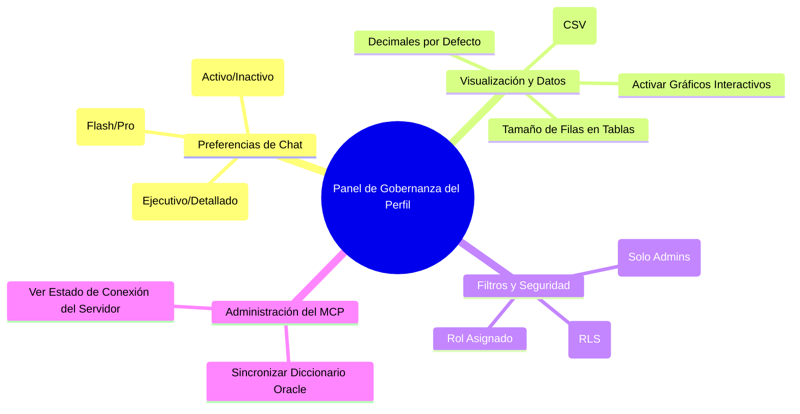

# Guía de Estandarización y Gobernanza del Perfil de Usuario
## Proyecto: OpenEnergy / OSAM v2 (Osinergmin)

Esta guía propone una estructura sistemática para estandarizar las capacidades actuales y futuras del asistente analítico **OpenEnergy**. Su objetivo es transformar la arquitectura actual —donde las interacciones, filtros de seguridad y visualizaciones están acoplados globalmente— en un modelo de **Gobernanza y Personalización Centralizada desde el Perfil del Usuario**.

Con este modelo, cuando un usuario inicie sesión, su perfil determinará qué funciones están habilitadas, cómo interactúa la IA con él y qué nivel de control de datos posee.

---

## 1. Inventario y Estandarización de Funciones Actuales

Para poner orden al sistema, clasificamos las capacidades actuales del código en **cuatro dimensiones funcionales**. Cada una de ellas es candidata a ser activada, desactivada o configurada desde el panel del perfil:

### Dimensión A: Inteligencia y Orquestación Conversacional (LLM & MCP)
Estas funciones definen cómo piensa y se comunica el asistente con el usuario.

| Funcionalidad | Descripción Técnica Actual | Estado en el Código | Propuesta de Personalización |
| :--- | :--- | :--- | :--- |
| **Selección de Motor de IA (LLM Router)** | Router que conecta con modelos de Gemini (ej. `gemini-2.5-flash`). | Global en [app.py](file:///C:/Users/opaye/Proyectos/MCPdinamicoPrueba/agente-mcp/app.py). Fijo para todos. | Permitir al usuario elegir entre perfiles de velocidad/precisión (ej. *Flash* para consultas rápidas, *Pro* para análisis complejos de datos). |
| **Descubrimiento Semántico de Tablas** | Capacidad del LLM para leer descripciones de tablas de Oracle y sugerir datasets. | Automático en el prompt del sistema. | Interruptor: **"Sugerencias automáticas de Datasets"** (activa/desactiva la inyección del catálogo completo en el prompt para simplificar el flujo). |
| **Limpieza de Historial (Prompt Flattening)** | Proceso en backend que borra llamadas a herramientas y payloads pesados del historial. | Automático e implícito en backend. | Frecuencia del limpiador: Ajustar si el usuario prefiere mantener más contexto histórico a costa de mayor consumo de tokens. |

### Dimensión B: Visualización e Interacción de Reportes (Frontend React)
Define cómo se presentan los resultados analíticos resultantes del compilador.

| Funcionalidad | Componente Frontend Involucrado | Estado en el Código | Propuesta de Personalización |
| :--- | :--- | :--- | :--- |
| **Gráficos Dinámicos Vega-Lite** | [VegaLiteChart.tsx](file:///C:/Users/opaye/Proyectos/MCPdinamicoPrueba/frontend/src/ui/components/VegaLiteChart.tsx) | Obligatorio si el LLM incluye un esquema de visualización. | Interruptor: **"Habilitar Gráficos Estadísticos"**. Si se desactiva, la IA solo presentará tablas y texto, ideal para conexiones lentas. |
| **Tablas Interactivas TanStack** | [OsamTable.tsx](file:///C:/Users/opaye/Proyectos/MCPdinamicoPrueba/frontend/src/ui/components/OsamTable.tsx) | Obligatorio para cualquier salida matricial. | Parámetros: **"Tamaño de página por defecto"** (10, 20, 50 registros) y **"Formato decimal preferido"** (ej. 2 o 3 decimales). |
| **Panel de Trazabilidad RLS / Linaje** | [OsamRenderer.tsx](file:///C:/Users/opaye/Proyectos/MCPdinamicoPrueba/frontend/src/ui/components/OsamRenderer.tsx) | Muestra el origen del dato y filtros RLS aplicados de forma colapsable. | Interruptor: **"Mostrar metadatos de procedencia (Linaje)"**. El usuario común puede ocultarlo para limpiar la UI; el auditor lo requiere siempre visible. |
| **Exportación de Datos (CSV/Excel)** | Control interno de la tabla en React. | Estático en la cabecera del componente. | Interruptor de seguridad: **"Permitir descarga local de datos"** (gobernado por perfil de seguridad). |

### Dimensión C: Seguridad y Acceso a Datos (Row-Level Security)
Define el alcance de los datos físicos que la IA puede consultar para el usuario.

| Funcionalidad | Componente Backend / Base de Datos | Estado en el Código | Propuesta de Personalización |
| :--- | :--- | :--- | :--- |
| **Restricción Regional (RLS)** | `translate_to_sql()` en [osam_gateway.py](file:///C:/Users/opaye/Proyectos/MCPdinamicoPrueba/agente-mcp/osam_gateway.py) | Inyecta obligatoriamente `WHERE DEPARTAMENTO = '...'` basado en la sesión. | Para Administradores/Auditores: Desplegable de **"Geografía de Simulación"** para emular el acceso de cualquier región (ej: Moquegua, Tacna, Nacional). |
| **Catálogo de Vistas Autorizadas** | `semantic_registry.py` (carga inicial) | Carga todas las tablas que devuelva el MCP. | Lista de verificación (Checklist): **"Mis Datasets Favoritos"** para restringir el alcance de la búsqueda semántica únicamente a las tablas con las que trabaja el usuario diariamente. |

### Dimensión D: Rendimiento y Configuración del Catálogo
Define parámetros operacionales del sistema.

| Funcionalidad | Componente Involucrado | Estado en el Código | Propuesta de Personalización |
| :--- | :--- | :--- | :--- |
| **Refresco del Catálogo MCP** | [semantic_registry.py](file:///C:/Users/opaye/Proyectos/MCPdinamicoPrueba/agente-mcp/semantic_registry.py) | Carga en arranque o mediante parámetro `force_refresh`. | Botón interactivo en el perfil: **"Sincronizar Catálogo con Oracle"** (invalida el caché local `semantic_catalog.json` y trae la metadata fresca). |

---

## 2. Propuesta de Arquitectura del Perfil de Usuario

Para dar gobernanza al usuario, la pantalla de **"Mi Perfil / Configuración"** en el frontend de React debe estar estructurada en pestañas claras. A continuación se describe el diseño conceptual de estas secciones:



### Secciones Propuestas para la Interfaz de Configuración

#### Pestaña 1: Configuración de la IA e Interacción
*   **Modo de Respuesta:**
    *   `Ejecutivo`: Respuestas cortas, insights rápidos y gráficos prioritarios.
    *   `Técnico`: Explicaciones detalladas de fórmulas, muestra el SQL generado y el linaje de datos de manera expandida.
*   **Asistente Semántico:**
    *   *Activar Autocompletado del Catálogo:* Ayuda al usuario a escribir nombres de campos correctos mientras redacta la pregunta.

#### Pestaña 2: Control de Visualización y Reportes
*   **Preferencia de Gráficos:**
    *   *Renderizado Automático:* Dibujar gráficos estadísticos automáticamente si el reporte tiene dimensiones temporales o nominales.
    *   *Solo Tablas:* Desactiva Vega-Lite para acelerar el renderizado en conexiones lentas.
*   **Preferencias de Datos:**
    *   *Formato numérico:* Definir separadores de miles y cantidad de decimales por defecto para los reportes financieros o técnicos de energía.

#### Pestaña 3: Gobernanza de Datos y Seguridad (RLS)
*   **Ámbito Geográfico de Consulta:**
    *   Muestra la región asignada oficialmente (ej: *Departamento: Arequipa*). Esto es de solo lectura para analistas comunes.
    *   *Emulación Regional (Solo Roles de Gobierno/Admin):* Un desplegable para cambiar de región en caliente y verificar cómo se comportan los filtros RLS.

#### Pestaña 4: Conectividad y Catálogo (Herramientas de Datos)
*   **Estado de Sincronización:**
    *   Muestra la fecha y hora de la última carga del catálogo de Oracle.
    *   *Botón "Refrescar Metadatos del Servidor MCP":* Ejecuta la limpieza de la caché de metadatos cuando el departamento de TI añade nuevas tablas o comentarios a la base de datos de producción.

---

## 3. Matriz de Roles y Niveles de Gobernanza

No todos los usuarios deben tener acceso a las mismas personalizaciones. Proponemos la siguiente estructura de roles corporativos:

| Rol de Usuario | Permisos de RLS | Capacidad de Personalización | Configuración Sugerida por Defecto |
| :--- | :--- | :--- | :--- |
| **Gerente de Energía** (Toma de decisiones) | Acceso Nacional (Sin filtros geográficos). | - Elegir modelo de IA.<br>- Activar/Desactivar gráficos.<br>- Exportar datos. | Modo de respuesta: `Ejecutivo`. Gráficos automáticos encendidos. |
| **Analista Regional** (Fiscalizador) | Filtrado RLS determinista estricto por su respectiva región. | - Ajustar decimales y tamaño de tablas.<br>- No puede desactivar RLS ni emular otras regiones. | Modo de respuesta: `Técnico`. Filtros regionales fijos. |
| **Administrador de Datos / TI** | Acceso Completo. | - Forzar refresco de metadatos MCP.<br>- Emular cualquier perfil geográfico.<br>- Ver logs de ejecución y SQL generado. | Muestra SQL y procedencia siempre visible. Opción de refresco manual de catálogo activa. |
| **Usuario de Consulta** (Invitado) | RLS Regional o restringido a vistas públicas. | - Preferencias básicas de visualización (modo oscuro, tamaño de fuente). | Gráficos e interactividad simplificados. Exportación de datos bloqueada. |

---

## 4. Plan de Implementación Técnica (Sin Código)

Para incorporar esta gobernanza en el proyecto actual de forma limpia, se recomienda seguir los siguientes pasos técnicos:

```
[Acción del Usuario en UI] ➔ [React Context (UserPreferences)] ➔ [Guardado en DB/Local]
                                        │
                                        ▼ (Envío en WS)
                            [app.py (cl.user_session)] ➔ [Modifica Prompt de Gemini]
                                        │
                                        ▼ (Compilación)
                            [osam_gateway.py] ➔ [Aplica RLS y Límites dinámicos]
```

### Paso 1: Crear un Contrato de Preferencias (Frontend)
Definir un tipo estructurado en TypeScript (ej. en [chat.ts](file:///C:/Users/opaye/Proyectos/MCPdinamicoPrueba/frontend/src/domain/types/chat.ts)) que encapsule las preferencias del usuario:
*   `userModel`: `'gemini-flash' | 'gemini-pro'`
*   `renderCharts`: `boolean`
*   `decimalPlaces`: `number`
*   `responseStyle`: `'executive' | 'technical'`
*   `simulatedGeography`: `string | null` (solo administradores)

### Paso 2: Transmitir Preferencias en cada Solicitud (WebSocket)
Cuando el usuario envía una pregunta desde `App.tsx`, las preferencias seleccionadas en su perfil deben enviarse como metadatos en la carga útil (payload) del socket hacia `app.py`.

### Paso 3: Consumir Preferencias en el Backend
*   **En el Router de IA (`app.py`):**
    *   Si el usuario seleccionó `responseStyle = 'executive'`, inyectar al prompt de Gemini: *"Sé breve, ve al grano y proporciona análisis ejecutivos de alto nivel"*.
    *   Si seleccionó `responseStyle = 'technical'`, inyectar: *"Proporciona un desglose detallado de los cálculos, fórmulas y procedencia de datos"*.
    *   Utilizar el modelo seleccionado en el perfil para instanciar el cliente del LLM en lugar del modelo fijo.
*   **En el Compilador SQL (`osam_gateway.py`):**
    *   Utilizar la geografía simulada (`simulatedGeography`) si el usuario tiene rol de Administrador. De lo contrario, usar la geografía real del token JWT Keycloak.

### Paso 4: Condicionar el Renderizado en el Cliente
*   **En `OsamRenderer.tsx`:**
    *   Leer la configuración de visualización activa. Si `renderCharts` es falso, omitir el componente `VegaLiteChart` y mostrar únicamente la tabla de datos estructurados para optimizar recursos de memoria.

---

### Beneficios del Modelo Propuesto
1.  **Orden Arquitectónico:** Separa la lógica de presentación (UI) y las políticas corporativas (Seguridad/RLS) de la configuración individual del usuario.
2.  **Consumo Eficiente de Tokens:** Al permitir a los usuarios apagar la inyección completa de metadatos o limitar el historial, se reducen los costos y latencias asociadas a la API del LLM.
3.  **Seguridad y Auditoría Simplificada:** El administrador puede validar en caliente el comportamiento del RLS simulando diferentes regiones desde su propio perfil sin necesidad de alterar el código o las variables de entorno `.env`.
