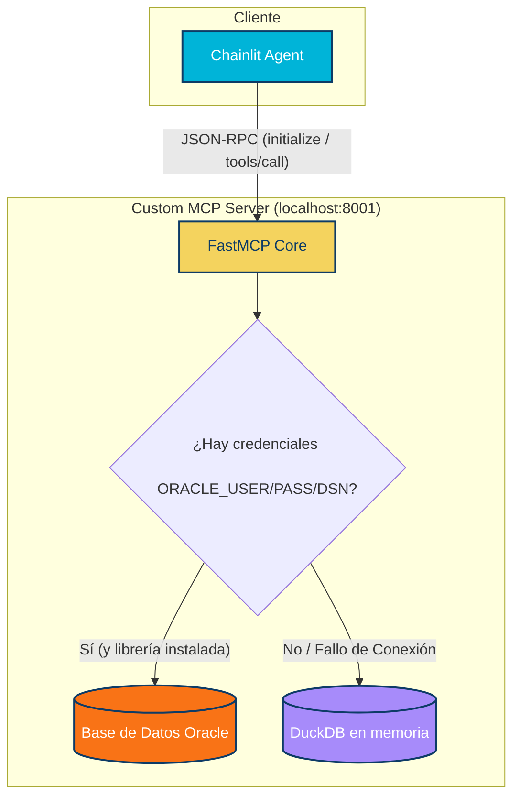

# Guía e Integración del Servidor MCP Local

Hemos recreado y puesto en marcha un servidor MCP personalizado utilizando la especificación oficial sobre **SSE (Server-Sent Events)** con **FastMCP** (FastAPI/Uvicorn bajo el capó).

---

## 1. Diseño y Estructura del Servidor

El servidor ha sido guardado en la raíz de tu workspace: [mcp_server.py](file:///C:/Users/opaye/Proyectos/MCPdinamicoPrueba/mcp_server.py).

### Arquitectura de Conexión de Datos (Resiliente)



---

## 2. Herramientas Recreadas y Soporte SSE

El servidor expone exactamente las siguientes herramientas requeridas por tu backend analítico:

1.  **`get_catalogo_datos`**: Retorna el listado de tablas físicas gobernadas de Osinergmin (`CMO_TX_CENTRAL_GEN`, `VW_EESS_UBICACION_GEO`, `DEMANDA_DIARIA_ELEC`), incluyendo sus esquemas y descripciones semánticas.
2.  **`get_detalle_catalogo_datos`**: Retorna la especificación física y comentarios de columnas (nombres, tipos de datos Oracle como `NUMBER`, `VARCHAR`, `DATE` y descripciones semánticas).
3.  **`query_data`**: Realiza consultas SQL directas a Oracle o DuckDB, aceptando nombres de tablas, filtros lógicos (WHERE) y límites.
4.  **`get_unidades`**: Retorna estaciones de servicio georreferenciadas (grifos).
5.  **`calculator`** y **`get_weather`**: Herramientas utilitarias para depuración.

---

## 3. Resultados Exitosos del Diagnóstico Local

Hemos ejecutado un script de verificación automatizado que simuló el ciclo de vida completo de un cliente MCP estándar. El servidor respondió con éxito bajo el estándar SSE:

*   **GET `/sse`**: 🟢 `200 OK` (Crea el canal de flujo persistente de eventos `text/event-stream`).
*   **Evento `endpoint`**: 🟢 Retornó la URI dinámica del buzón de mensajes (ej. `/messages/?session_id=be7ba0...`).
*   **JSON-RPC `initialize`**: 🟢 `202 Accepted` y entregó las capacidades del servidor en el stream SSE de forma asíncrona.
*   **JSON-RPC `tools/list`**: 🟢 Lista las 6 herramientas disponibles con sus esquemas JSON correspondientes.
*   **JSON-RPC `tools/call`**: 🟢 Ejecutó exitosamente `get_catalogo_datos` y retornó la estructura del catálogo.

---

## 4. Cómo levantar el servidor y conectarlo a Oracle

### Paso 1: Configurar Credenciales de Oracle (Opcional)
Para conectarse a la base de datos Oracle física corporativa, edita tu archivo [.env](file:///C:/Users/opaye/Proyectos/MCPdinamicoPrueba/.env) e introduce las siguientes variables:

```env
ORACLE_USER=tu_usuario
ORACLE_PASSWORD=tu_contraseña
ORACLE_DSN=host_or_ip:puerto/nombre_servicio
```

> [!NOTE]
> Si no configuras estas variables o el driver `oracledb` no está instalado, el servidor MCP local cambiará automáticamente a **DuckDB en memoria** y precargará los mismos registros y tablas de prueba para garantizar un entorno 100% funcional.

### Paso 2: Instalar Dependencias
Instala el cliente ligero thin-client de Oracle para Python ejecutando en tu terminal:
```bash
.venv\Scripts\pip.exe install oracledb
```

### Paso 3: Levantar el Servidor MCP
El servidor se ejecuta en el puerto `8001` (para evitar chocar con Chainlit que corre en el `8000`):
```powershell
$env:PORT="8001"; .venv\Scripts\python.exe mcp_server.py
```
> [!TIP]
> Si deseas cambiar el host o el puerto de escucha, puedes usar las variables de entorno `$env:PORT` y `$env:HOST`.
