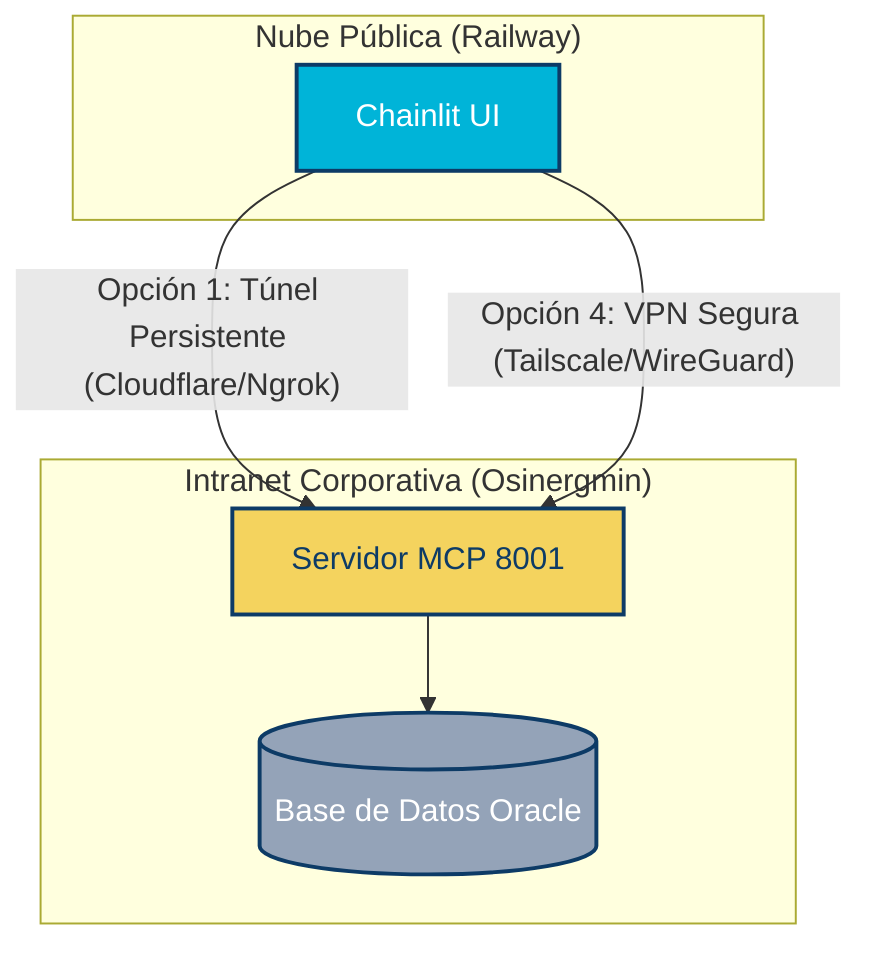

# Estrategias de Conexión: Chainlit Público y MCP Privado

Cuando el servidor MCP se encuentra en una red privada corporativa (como la intranet de Osinergmin, IP `x.x.x.x`) y la interfaz de usuario de Chainlit se despliega en una nube pública (como Railway), la interfaz no puede conectarse directamente a la dirección IP privada.

A continuación, se presentan las **4 estrategias recomendadas** para superar esta limitación, ordenadas según su facilidad de implementación y nivel de seguridad.

---

---

## Estrategia 1: Despliegue 100% Interno (On-Premises / Intranet)
*Recomendada si los datos son estrictamente confidenciales y se cuenta con infraestructura interna.*

En lugar de desplegar Chainlit en Railway (nube pública), se hospeda tanto el backend del MCP como el frontend de Chainlit en la misma red privada de Osinergmin.

* **Cómo funciona**:
  1. Se despliega la carpeta `agente-mcp` en el mismo servidor (`10.10.17.216`) o en otra máquina virtual de la intranet corporativa.
  2. Se ejecuta Chainlit apuntando localmente a `localhost:8001` (o la IP privada).
  3. El equipo de TI/Redes mapea un nombre DNS interno (ej. `http://asistente-mcp.osinergmin.gob.pe`) apuntando al puerto `8080` de esa máquina.
* **Ventajas**:
  * **Seguridad Máxima**: Los datos de Osinergmin nunca salen de la red corporativa.
  * **Cero Latencia**: La comunicación entre Chainlit y el MCP es directa y veloz.
  * No requiere túneles públicos de terceros.
* **Desventajas**: Requiere acceso por VPN para los usuarios externos a la red.

---

## Estrategia 2: Cloudflare Tunnels (Túnel Inverso Persistente)
*Recomendada para mantener la app en Railway de forma gratuita, estable y segura.*

En lugar de usar túneles de desarrollo de VS Code (`devtunnels.ms`) que caducan rápido y son bloqueados por firewalls, se utiliza **Cloudflare Tunnel (cloudflared)**.

* **Cómo funciona**:
  1. Se instala el agente ligero `cloudflared` en el servidor de Osinergmin.
  2. El agente establece una conexión segura saliente hacia los servidores de Cloudflare (no requiere abrir puertos de entrada en el Firewall).
  3. Se asocia el túnel a un subdominio HTTPS público y estático (ej. `https://mcp-api.tudominio.com`).
  4. En Railway, configuras `MCP_SERVER_URL=https://mcp-api.tudominio.com`.
* **Ventajas**:
  * **Estable y Resiliente**: El túnel se puede levantar como un servicio del sistema (se reconecta automáticamente si el servidor se reinicia).
  * **Gratuito y Seguro**: Cloudflare cifra todo el tráfico y permite añadir reglas de acceso (ej. bloquear peticiones que no vengan de la IP de Railway).

---

## Estrategia 3: VPN Mesh con Tailscale
*La mejor opción para conectar Railway y la Intranet de forma totalmente privada.*

Se crea una red privada virtual (VPN) híbrida entre los contenedores de Railway y el servidor de Osinergmin.

* **Cómo funciona**:
  1. Se instala **Tailscale** en el servidor de Osinergmin.
  2. Se configura la app de Railway utilizando un Dockerfile adaptado que inicialice un cliente Tailscale al arrancar.
  3. Ambas máquinas se unen a una red privada virtual de Tailscale (donde cada máquina recibe una IP virtual segura e interna).
  4. Chainlit se conecta al servidor MCP usando la IP de Tailscale del servidor (ej. `http://100.x.y.z:8001`).
* **Ventajas**:
  * El tráfico no es público en Internet en ningún momento.
  * Pasa a través de firewalls corporativos estrictos sin configuraciones complejas de red.

---

## Estrategia 4: Migrar la Base de Datos a Railway (Si es viable)
*Recomendada si los datos pueden residir en la nube y el MCP se puede alojar en Railway.*

Si el servidor MCP no necesita consultar necesariamente la base de datos interna de producción en tiempo real (o si esta puede replicarse), se sube todo a Railway.

* **Cómo funciona**:
  1. Se despliega una base de datos (ej. PostgreSQL o MySQL) en Railway.
  2. Se sube tanto el Servidor MCP como Chainlit a Railway como dos servicios del mismo proyecto.
  3. Se comunican utilizando la red privada interna de Railway (`http://mcp-service.railway.internal:8001`).
* **Ventajas**:
  * Simplicidad de gestión en una sola plataforma.
  * Velocidad óptima de consulta.
* **Desventajas**: No es viable si el MCP requiere interactuar con sistemas de Osinergmin legados que no pueden migrarse.
